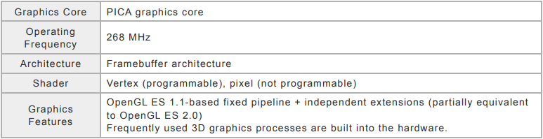

# Minecraft-3ds-shader

This repository holds a discontinued version of Minecraft default in-game shader file

# Introduction

Vertex shaders are the only programmable shaders implemented by the CTR-SDK(PICA200). Vertex shaders are written in PICA-specific assembly language. The OpenGL ES 2.0 API loads the executable files and then runs the shaders. The OpenGL ES 2.0 API can load only executable files that have been assembled and linked. You can't load shader files written in GLSL.

Vertex shaders are run from the **main** function. A **main** object is an object file that can be assembled from an assembly code file that has a **main** function. A reference object is an object file that can be assembled from an assembly code file that does not have a **main** function.

To put a **main** function in an assembly code file, set the **main** label at the location where shader execution starts and set the **endmain** label after the last instruction at the end of the main function.(This is the last instruction in the main function, not the last instruction in the assembly code file.)A reference object only has subroutines and is referenced by a main object to resolve unresolved labels. When the objects are linked to create an executable file, the executable file does not include reference objects that are not referenced by any main objects

**Input Registers**

Input registers are floating-point registers that store vertex attribute data ("attributes" in OpenGL ES 2.0 applications).

**Temporary Registers**

Temporary registers are floating-point registers that temporarily maintain calculation results to be reused later. Their values are preserved until they are overwritten.

**Floating-Point Constant Registers**

Floating-point constant registers are floating-point registers that store constants to use for calculations. Uniforms for OpenGL ES 2.0 applications are stored here.

**Output Registers**

These registers output data that has been processed by vertex shaders into a later stage of the graphics pipeline.

# Building
You can use either the nintendo 3ds devkit or [Picasso](https://github.com/devkitPro/picasso)) as the assembler. If you choose to use Picasso, please be sure to follow the instructions and use the files provided in the [homebrew](https://github.com/ENDERMANYK/Minecraft-3ds-shader/blob/main/homebrew/README.md)) directory.
